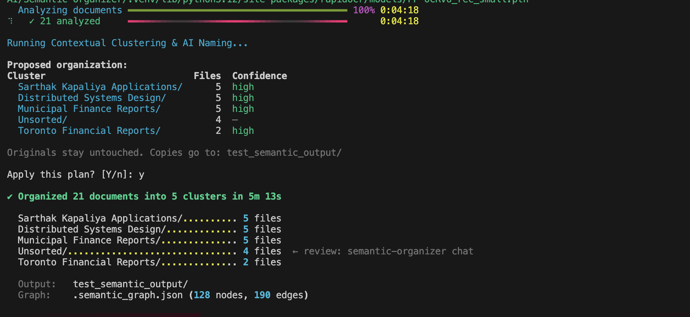

# Semantic Organizer



A privacy-first, local AI tool that transforms messy folders of unstructured documents into a clean semantic taxonomy and a queriable Knowledge Graph.

Instead of relying on cloud APIs or brittle vector embeddings, Semantic Organizer runs entirely on your local machine using **LM Studio** and **IBM Docling**, utilizing a pure GraphRAG approach (NetworkX).

## Features
- **Auto-Organization:** Clusters documents into meaningful folders based on shared entities and tags, with a Terraform-style Plan/Apply workflow.
- **Three Extraction Tiers:** `fast` (small models), `graph` (large reasoning models), and `auto` (smart block-based chunking with an orchestrator).
- **Interactive GraphRAG Chat:** Grounded Q&A over your documents with guaranteed citations.
- **Visual Knowledge Graph:** Exports an interactive 3D HTML network map of your entire vault.

## Quickstart

1. Have **LM Studio** running locally at `http://localhost:1234/v1` with your chosen models loaded.
2. Install via `uv`:
```bash
git clone https://github.com/sarthak/semantic-organizer.git
cd semantic-organizer
uv sync
```
3. Test your environment:
```bash
uv run semantic-organizer doctor
```
4. Organize a folder!
```bash
uv run semantic-organizer organize ~/Downloads ~/Organized --method fast
```

## CLI Commands

- `organize <SRC> <DEST>`: Analyzes and clusters documents, moving them into a semantic hierarchy.
- `chat`: Launches an interactive Vectorless GraphRAG chat over your organized vault.
- `visualize`: Generates `graph.html`, a beautiful interactive visualization of your documents, folders, tags, and entities.
- `doctor`: Verifies LM Studio connectivity and model availability.
- `sweep`: (Coming Soon) Cleans up old, unused files based on OS metadata.

For a deep dive into the system design, check out the [Technical Architecture Report](docs/architecture.md).
