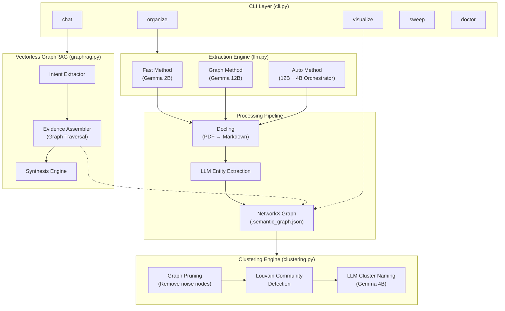
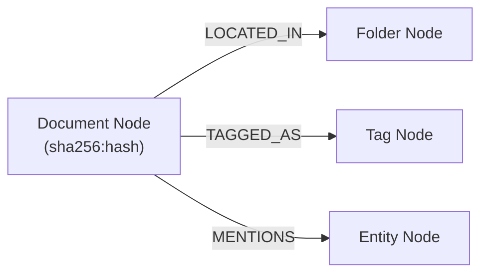

# Semantic Organizer — Technical Report


> **Version:** 0.1.0  
> **Author:** Sarthak Kapaliya  
> **Date:** August 2026  
> **License:** MIT  

---

## 1. Executive Summary

**Semantic Organizer** is a local, privacy-first document intelligence CLI that transforms unstructured file collections into semantically organized folder hierarchies. It uses on-device Large Language Models (LLMs) to read, understand, and categorize documents — then sorts them into human-readable folders automatically.

Unlike cloud-based solutions, **all data stays on the user's machine**. No files are uploaded. No API keys leave the device. The entire AI pipeline runs locally via [LM Studio](https://lmstudio.ai/) or [Ollama](https://ollama.com/).

### What It Does (In One Sentence)

> Point it at a messy folder of 500 PDFs. Walk away. Come back to find them perfectly sorted into folders like `Financial Reports/`, `Job Applications/`, and `System Architecture/` — with a searchable knowledge graph you can chat with.

---

## 2. System Architecture



### Core Design Principles

| Principle | Implementation |
|---|---|
| **Privacy-First** | Zero cloud dependencies. All AI inference runs locally via LM Studio or Ollama. |
| **Vectorless RAG** | No embedding models. No vector databases. Retrieval is done via graph traversal and LLM reasoning. |
| **Multi-Model Routing** | Different model sizes are assigned to different tasks based on complexity. |
| **Crash Recovery** | An SQLite-backed Operation Journal tracks per-document state for idempotent reruns. |
| **Apple Silicon Native** | Docling runs on Apple MPS GPU. PyTorch weights are loaded as a Singleton to avoid 770MB reload per document. |

---

## 3. Source Code Reference

The project contains **14 Python source files** inside the `semantic_organizer/` package. Each file has a single, well-defined responsibility.

### 3.1 Entry Points

#### [`main.py`](./main.py)
The root script. Delegates to the Typer CLI app. Also configured as a global entry point via `pyproject.toml`:
```toml
[project.scripts]
semantic-organizer = "semantic_organizer.cli:app"
```

#### [`cli.py`](src/semantic_organizer/cli.py) — 322 lines
The command-line interface. Built with [Typer](https://typer.tiangolo.com/) and [Rich](https://rich.readthedocs.io/). Exposes all user-facing commands.

| Command | Description |
|---|---|
| `organize <source> [target]` | Scans a folder, extracts semantic metadata from every document, clusters them via Louvain, names the clusters with an LLM, and physically copies files into the new folder hierarchy. |
| `chat <target>` | Launches an interactive Vectorless GraphRAG terminal. The user asks natural-language questions and the AI traverses the knowledge graph to find answers. |
| `visualize <target>` | Generates an interactive HTML visualization of the knowledge graph using PyVis, then opens it in the default browser. |
| `sweep [--days N]` | Scans the graph for documents that haven't been accessed in `N` days and offers to delete them, reclaiming disk space. |
| `doctor` | Health check. Verifies that LM Studio is reachable and lists available models. |

**Key Design Decision — Main-Thread Execution:**  
Running Apple MPS PyTorch models inside Python background threads causes silent process death due to semaphore deadlocks. When `threads == 1` (the default), the CLI executes all extraction sequentially on the main thread via a `for` loop, bypassing `concurrent.futures.ThreadPoolExecutor` entirely.

---

### 3.2 Configuration

#### [`config.py`](src/semantic_organizer/config.py) — 46 lines
Manages all runtime configuration via Pydantic models. Loads settings from a YAML file (`semantic-organizer.yaml`) or falls back to sensible defaults.

**Configuration Schema:**

```yaml
neo4j:
  uri: "bolt://localhost:7687"
  user: "neo4j"
  password: "password"

llm:
  base_url: "http://localhost:1234/v1"
  api_key: "lm-studio"
  fast_extraction_model: "google/gemma-4-e2b"      # 2B params
  graph_extraction_model: "google/gemma-4-12b"      # 12B params
  clustering_model: "google/gemma-4-e4b"            # 4B params
```

**Multi-Model Routing Strategy:**

| Task | Model | Why |
|---|---|---|
| Fast entity extraction | `gemma-4-e2b` (2B) | Only needs to read 5 pages and output a JSON blob. Speed > depth. |
| Deep graph extraction | `gemma-4-12b` (12B) | Processes dense financial/legal text. Needs strong reasoning. |
| Cluster naming + Orchestrator evaluation | `gemma-4-e4b` (4B) | Needs to reason about entity lists but doesn't need to read raw text. |

---

### 3.3 Data Models

#### [`models.py`](src/semantic_organizer/models.py) — 40 lines
Pydantic data models that define the schema for all extracted information.

| Model | Fields | Purpose |
|---|---|---|
| `Entity` | `name`, `type` | A named entity (Person, Organization, Location, Concept). |
| `Tag` | `name` | A lowercase descriptive tag (e.g., "finance", "annual report"). |
| `OSMetadata` | `size_bytes`, `last_accessed`, `last_modified`, `original_folder` | Filesystem metadata captured at extraction time. |
| `SemanticPayload` | `summary`, `entities[]`, `tags[]`, `confidence` | The complete semantic fingerprint of a single document. |
| `ParsedDocument` | `document_id`, `source_path`, `markdown`, `pages`, `content_hash`, `chunks[]` | The raw parsed representation from Docling. |
| `DocumentChunk` | `chunk_index`, `text`, `metadata` | A single chunk of text from a chunked document. |

---

### 3.4 Document Extraction

#### [`parser.py`](src/semantic_organizer/parser.py) — 85 lines
Low-level document parsing via IBM's [Docling](https://github.com/DS4SD/docling). Converts PDFs, DOCX, PPTX, XLSX, HTML, and Markdown files into structured Markdown text and semantic chunks.

**Key Functions:**
- `compute_file_hash(file_path)` — SHA-256 content hashing for deduplication and integrity verification.
- `get_converter()` — Initializes a `DocumentConverter` with OCR and table structure detection disabled for speed.
- `extract_text(file_path)` — Full extraction pipeline: convert → export to Markdown → chunk via `HybridChunker`.

#### [`llm.py`](src/semantic_organizer/llm.py) — 247 lines
The core intelligence engine. Contains three extraction methods and two critical monkey-patches.

**Monkey-Patches (Applied at Module Load):**

1. **LiteLLM Response Format Patch:** IBM's `docling_graph` library sends `response_format: {"type": "json_object"}` to the LLM backend. LM Studio rejects this with a `400 Bad Request`. The patch intercepts `LiteLLMClient._build_request()` and strips this field.

2. **DocumentConverter Singleton Patch:** Without this, `docling_graph` reloads 770MB of PyTorch OCR weights for every single document. The patch overrides `DocumentConverter.__new__()` and `__init__()` to return the same global instance after the first initialization.

**Extraction Methods:**

##### Method 1: `process_document_fast(file_path)` — The Speed Demon
1. Initializes Docling with Apple MPS GPU acceleration.
2. Converts only the **first 5 pages** of the PDF (`page_range=(1, 5)`).
3. Truncates the Markdown output to 16,000 characters.
4. Sends the text to the **2B model** with a structured JSON extraction prompt.
5. Parses the JSON response into a `SemanticPayload`.

**Performance:** ~15 seconds per document.

##### Method 2: `process_document(file_path, method="graph")` — The Deep Analyzer
Delegates to IBM's `docling_graph.run_pipeline()` with a full configuration dict. Uses the **12B model** for dense entity extraction with chunking, gleaning, and deduplication.

**Performance:** ~2-5 minutes per document (depending on page count).

##### Method 3: `process_document_auto(file_path)` — The Smart Orchestrator
A novel multi-agent loop that dynamically decides how deeply to read a document:

```
for each block of 5 pages:
    1. Convert pages to Markdown via Docling
    2. Extract entities/tags via 12B model
    3. Accumulate keywords into a running set
    4. Ask the 4B Orchestrator: "Do we have enough keywords?"
       → If YES: break (stop reading)
       → If NO:  continue to next block
```

**Key Feature — Graceful End-of-Document Handling:**  
Docling throws a hard exception if you request pages beyond the document's length. The auto method catches the specific error message `"fewer than the requested page_range"` and gracefully terminates the loop.

**Performance:** 15 seconds for a 1-page cover letter, ~60 seconds for a 100-page financial report (early-stopped at page 15).

---

### 3.5 Knowledge Graph

#### [`graph.py`](src/semantic_organizer/graph.py) — 95 lines
Manages the local knowledge graph using [NetworkX](https://networkx.org/). The graph is persisted as a JSON file (`.semantic_graph.json`) using NetworkX's `node_link_data` serialization format.

**Graph Schema:**



| Node Type | ID Format | Attributes |
|---|---|---|
| Document | `sha256:<hash>` | `path`, `filename`, `extension`, `summary`, `size_bytes`, `last_accessed`, `last_modified`, `original_folder` |
| Folder | `folder:<name>` | `name` |
| Tag | `tag:<lowercase_name>` | `name` |
| Entity | `entity:<type>:<lowercase_name>` | `name`, `entity_type` |

| Edge Type | From | To |
|---|---|---|
| `LOCATED_IN` | Document | Folder |
| `TAGGED_AS` | Document | Tag |
| `MENTIONS` | Document | Entity |

**Scalability:** A graph with 200 documents, 1,000 tags, and 5,000 edges serializes to approximately **1 MB** of JSON.

---

### 3.6 Clustering & Organization

#### [`clustering.py`](src/semantic_organizer/clustering.py) — 108 lines
Implements the semantic clustering pipeline that groups documents into folders.

**Algorithm:**

1. **Graph Pruning:** Remove all Tag/Entity nodes with `degree ≤ 1` (connected to only one document). These are "noise" nodes that don't contribute to clustering. This forces Louvain to only consider shared connections.

2. **Louvain Community Detection:** Run the [Louvain algorithm](https://en.wikipedia.org/wiki/Louvain_method) on the pruned undirected graph. This produces a set of communities where documents that share many entities/tags are grouped together.

3. **LLM Cluster Naming:** For each community, extract the top-10 most frequent entities and top-5 tags. Send them to the **4B model** with a prompt asking for a short folder name (e.g., "Financial Reports", "Human Resources").

4. **Sanitization:** The LLM's response is stripped of quotes, special characters, and prefixes to produce a clean filesystem-safe folder name.

---

### 3.7 Vectorless GraphRAG

#### [`graphrag.py`](src/semantic_organizer/graphrag.py) — 174 lines
A complete Retrieval-Augmented Generation (RAG) system that uses **zero vector embeddings**. Instead of similarity search, it uses LLM-guided graph traversal.

**Architecture — Three-Stage Pipeline:**

##### Stage 1: Intent Extraction (`IntentExtractor`)
The user's natural-language query is sent to the **12B model** with structured output. The model classifies the query into one of three intents:

| Intent | Trigger Example | Action |
|---|---|---|
| `FindDocuments` | "Find my resume" | Search graph for documents matching the entities/filenames. |
| `SummarizeTopic` | "What is the 2024 audit about?" | Find matching documents, extract their summaries, and synthesize an answer. |
| `EntityRelationships` | "What is related to Toronto?" | Find all entities that co-occur with the queried entity across documents. |

##### Stage 2: Evidence Assembly (`EvidenceAssembler`)
Traverses the local NetworkX graph to collect evidence. The traversal algorithm:

1. Scan all nodes for fuzzy matches against the extracted entities (matching Entity names, Tag names, and Document filenames).
2. For `FindDocuments`: Walk from matched nodes to their Document neighbors.
3. For `EntityRelationships`: Walk matched → Document → other Entity/Tag to find co-occurrences.
4. For `SummarizeTopic`: Walk to Document neighbors and extract their `summary` attribute.

##### Stage 3: Synthesis (`SynthesisEngine`)
The collected evidence is injected into a grounded generation prompt with strict citation rules. The **12B model** generates the final answer, citing specific document filenames.

---

### 3.8 Supporting Modules

#### [`autostructure.py`](src/semantic_organizer/autostructure.py) — 150 lines
Reads `.semantic.json` sidecar files and asks the LLM to design an optimal folder hierarchy. Supports `--apply` for execution and dry-run preview by default.

#### [`sidecar.py`](src/semantic_organizer/sidecar.py) — 102 lines
Generates two companion files for each organized document:
- **`.semantic.json`** — Machine-readable metadata (entities, tags, summary, hash).
- **`.semantic.md`** — Human-readable Markdown with YAML frontmatter, Obsidian WikiLinks, and Dataview queries for integration with [Obsidian](https://obsidian.md/).

#### [`journal.py`](src/semantic_organizer/journal.py) — 132 lines
An SQLite-backed state machine for crash recovery. Tracks each document through 8 states:

```
PLANNED → PARSED → ANALYZED → GRAPH_WRITTEN → COPIED → VERIFIED → ARTIFACTS_WRITTEN → COMPLETED
```

If the pipeline crashes mid-run, calling `organize` again will automatically resume from the last completed state via `start_or_resume_run()`.

#### [`routing.py`](src/semantic_organizer/routing.py) — 91 lines
Handles safe file copy operations with integrity verification:
1. Copy to a `.tmp` file.
2. Verify SHA-256 hash matches the original.
3. Write sidecar artifacts.
4. Atomic rename `.tmp` → final path.

#### [`restructure.py`](src/semantic_organizer/restructure.py) — 79 lines
Contains `OverlapAnalyzer` (finds categories with shared concepts) and `RollbackManager` (creates a JSON manifest of all file moves and can reverse them).

---

## 4. Dependency Stack

| Dependency | Version | Purpose |
|---|---|---|
| `typer` | ≥ 0.12.0 | CLI framework with auto-generated help and argument parsing. |
| `docling` | ≥ 2.0.0 | IBM's document converter. PDF/DOCX/PPTX → Markdown. |
| `docling-graph` | ≥ 0.1.0 | IBM's graph-based knowledge extraction pipeline. |
| `neo4j` | ≥ 5.23.1 | Neo4j driver (legacy, not actively used in current pipeline). |
| `openai` | ≥ 1.0.0 | OpenAI-compatible client for LM Studio / Ollama communication. |
| `rich` | ≥ 13.7.1 | Terminal formatting, progress bars, and colored output. |
| `pydantic` | ≥ 2.8.2 | Data validation and schema enforcement for all models. |
| `pyyaml` | ≥ 6.0.1 | YAML configuration file parsing. |
| `structlog` | ≥ 24.4.0 | Structured logging with JSON output for file logs. |
| `prompt-toolkit` | ≥ 3.0.53 | Interactive terminal input for the `chat` command. |
| `networkx` | (transitive) | In-memory graph database. Louvain community detection. |
| `pyvis` | (added) | Interactive HTML graph visualization. |
| `litellm` | (transitive) | Universal LLM client used by `docling_graph`. |

**Runtime Requirements:**
- Python ≥ 3.10
- macOS with Apple Silicon (for MPS GPU acceleration) or any system with CPU fallback
- A local LLM server (LM Studio or Ollama) running on `localhost:1234`

---

## 5. Data Flow — End-to-End Pipeline

```
┌─────────────────────────────────────────────────────────────────────┐
│                         USER RUNS:                                  │
│   semantic-organizer organize ~/Documents/Messy --method auto       │
└─────────────────────────────┬───────────────────────────────────────┘
                              │
                              ▼
┌─────────────────────────────────────────────────────────────────────┐
│  1. FILE DISCOVERY                                                  │
│     Recursively scan source_dir for all non-hidden files.           │
│     Result: [file1.pdf, file2.docx, file3.pdf, ...]                │
└─────────────────────────────┬───────────────────────────────────────┘
                              │
                              ▼
┌─────────────────────────────────────────────────────────────────────┐
│  2. EXTRACTION (per file)                                           │
│     Docling converts PDF → Markdown (MPS GPU accelerated).          │
│     LLM extracts: summary, tags[], entities[].                      │
│     Auto method: 12B extracts, 4B evaluates, early-stop if ready.   │
│     Output: SemanticPayload per document.                           │
└─────────────────────────────┬───────────────────────────────────────┘
                              │
                              ▼
┌─────────────────────────────────────────────────────────────────────┐
│  3. GRAPH CONSTRUCTION                                              │
│     For each document, create nodes (Document, Tag, Entity, Folder) │
│     and edges (TAGGED_AS, MENTIONS, LOCATED_IN).                    │
│     Persist to .semantic_graph.json.                                │
└─────────────────────────────┬───────────────────────────────────────┘
                              │
                              ▼
┌─────────────────────────────────────────────────────────────────────┐
│  4. CLUSTERING                                                      │
│     a. Prune noise nodes (degree ≤ 1, non-Document).               │
│     b. Run Louvain community detection on the pruned graph.         │
│     c. For each community, ask the 4B model to name it.             │
│     Output: { doc_id → "Financial Reports", ... }                   │
└─────────────────────────────┬───────────────────────────────────────┘
                              │
                              ▼
┌─────────────────────────────────────────────────────────────────────┐
│  5. FILE ORGANIZATION                                               │
│     Copy each file into target_dir/<cluster_name>/<filename>.       │
│     User's original files remain untouched.                         │
└─────────────────────────────────────────────────────────────────────┘
```

---

## 6. CLI Usage Examples

```bash
# Check if LM Studio is running
semantic-organizer doctor

# Organize documents (fast mode — ~15s per doc)
semantic-organizer organize ~/Documents/Messy ~/Documents/Organized --method fast

# Organize documents (auto mode — AI decides depth per doc)
semantic-organizer organize ~/Documents/Messy ~/Documents/Organized --method auto

# Visualize the knowledge graph
semantic-organizer visualize ~/Documents/Organized

# Chat with your documents
semantic-organizer chat ~/Documents/Organized

# Clean up old files (not accessed in 180 days)
semantic-organizer sweep --days 180
```

---

## 7. Known Limitations

| Issue | Impact | Planned Fix |
|---|---|---|
| **No `.semanticignore`** | Will scan `node_modules/`, `.git/`, and other unwanted directories. | Implement a `.gitignore`-style exclusion file. |
| **No `init` command** | No hidden `.semantic/` folder. Graph JSON is visible in the target directory. | Add `semantic-organizer init` to create a hidden workspace, similar to `git init`. |
| **No global config** | Users must place a YAML config file in the working directory. | Add `~/.config/semantic-organizer/config.yaml` with an interactive setup wizard. |
| **No `status` command** | Users cannot preview what will be organized before running `organize`. | Add a dry-run status command. |
| **No upward directory traversal** | The CLI does not auto-discover the nearest `.semantic/` folder by walking up the filesystem tree. | Implement `.git`-style parent directory scanning. |
| **Single LLM provider assumed** | Hardcoded to `http://localhost:1234/v1` (LM Studio). No support for Ollama or cloud APIs out of the box. | Add an interactive `config` wizard that supports multiple providers. |
| **Destructive organize** | `organize` copies files without a dry-run preview or undo mechanism in the active pipeline. | Integrate the existing `RollbackManager` and `OperationJournal` into the main `organize` command. |
| **Neo4j driver unused** | `neo4j` is still in the dependency list but the pipeline uses local NetworkX exclusively. | Remove the `neo4j` dependency to reduce install size. |

---

## 8. Future Roadmap

### Phase 1: Production CLI (Next)
- `semantic-organizer init` — Create hidden `.semantic/` workspace.
- `semantic-organizer config set` — Global configuration management.
- Interactive first-run setup wizard (provider selection, model configuration).
- `.semanticignore` file support.
- Upward directory traversal for auto-discovery.

### Phase 2: Distribution
- Homebrew Tap formula for `brew install`.
- PyPI publication for `uv tool install` / `pipx install`.
- Cross-platform testing (Linux, Windows WSL).

### Phase 3: Advanced Features
- Incremental indexing (only process new/modified files).
- Watch mode (`semantic-organizer watch`) for real-time file organization.
- Plugin system for custom extraction templates.
- Web UI dashboard for graph exploration.

---

## 9. Repository Structure

```
Semantic-Organizer/
├── main.py                          # Entry point
├── pyproject.toml                   # Project metadata, dependencies, entry points
├── uv.lock                         # Locked dependency versions
├── README.md                        # Project README
│
├── semantic_organizer/              # Main Python package
│   ├── __init__.py
│   ├── cli.py                       # Typer CLI commands (322 lines)
│   ├── config.py                    # Pydantic configuration loader (46 lines)
│   ├── models.py                    # Data models (40 lines)
│   ├── parser.py                    # Docling document parser (85 lines)
│   ├── llm.py                       # LLM extraction engine (247 lines)
│   ├── graph.py                     # NetworkX graph manager (95 lines)
│   ├── clustering.py                # Louvain clustering + LLM naming (108 lines)
│   ├── graphrag.py                  # Vectorless RAG pipeline (174 lines)
│   ├── autostructure.py             # LLM-driven folder hierarchy design (150 lines)
│   ├── sidecar.py                   # .semantic.json/.md artifact writer (102 lines)
│   ├── journal.py                   # SQLite crash recovery journal (132 lines)
│   ├── routing.py                   # Safe file copy with hash verification (91 lines)
│   └── restructure.py               # Overlap analysis and rollback (79 lines)
│
├── test_docs/                       # Test input documents
├── test_output/                     # Test organized output
├── tests/                           # Test suite
├── docs/                            # Documentation
└── lib/                             # External libraries
```

**Total Codebase:** ~1,741 lines of Python across 14 source files.

---

> *This report was generated for the Semantic Organizer project (v0.1.0). For questions or contributions, contact the author.*
